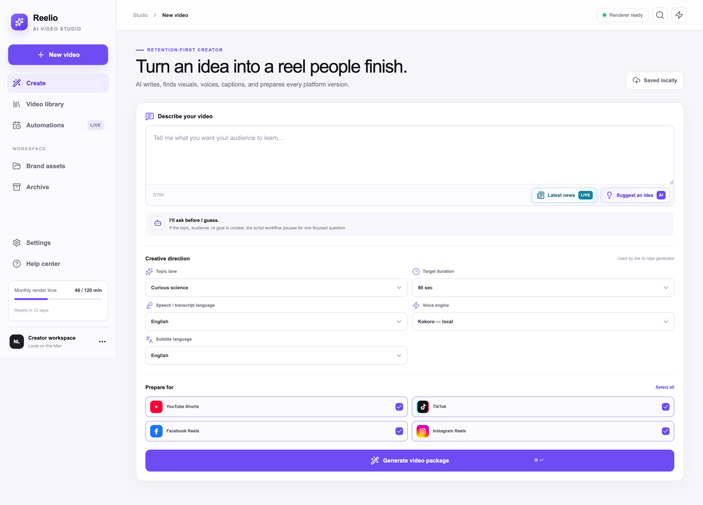
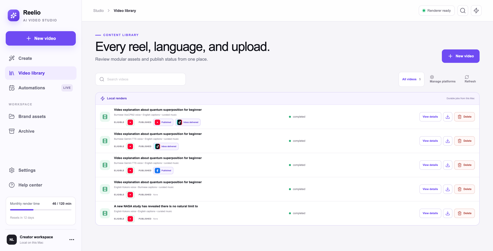
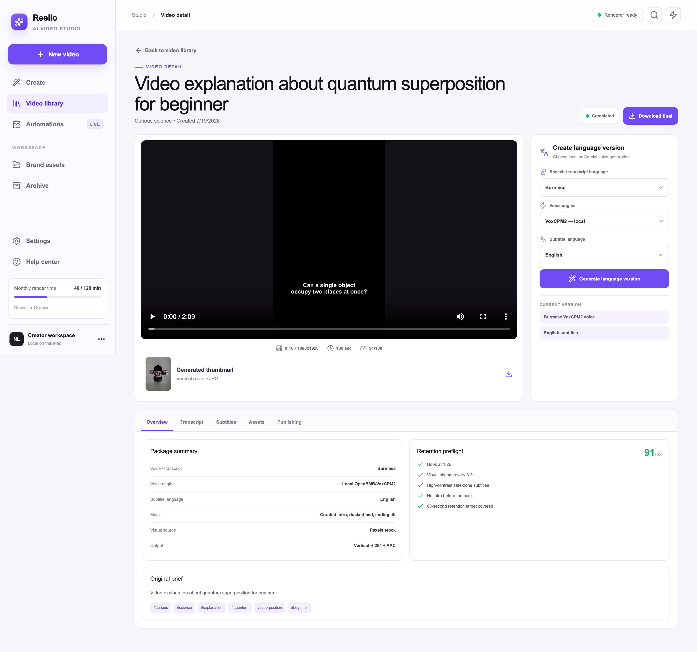
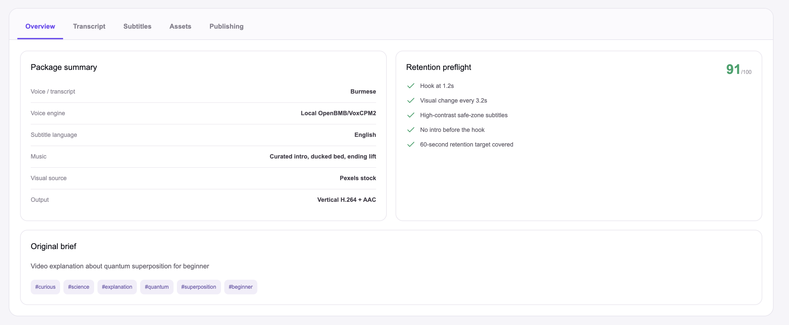
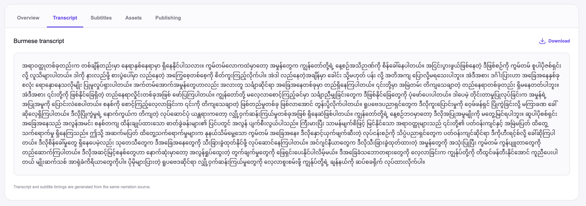
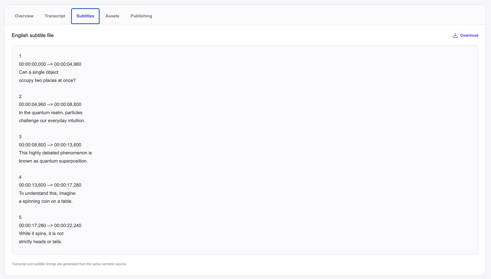
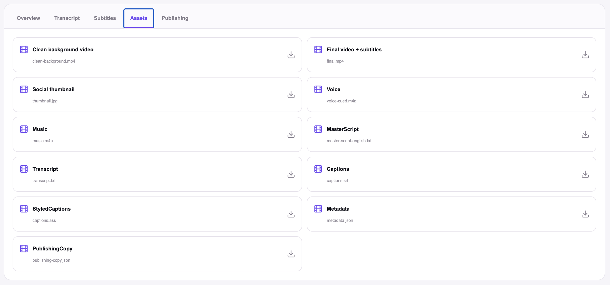
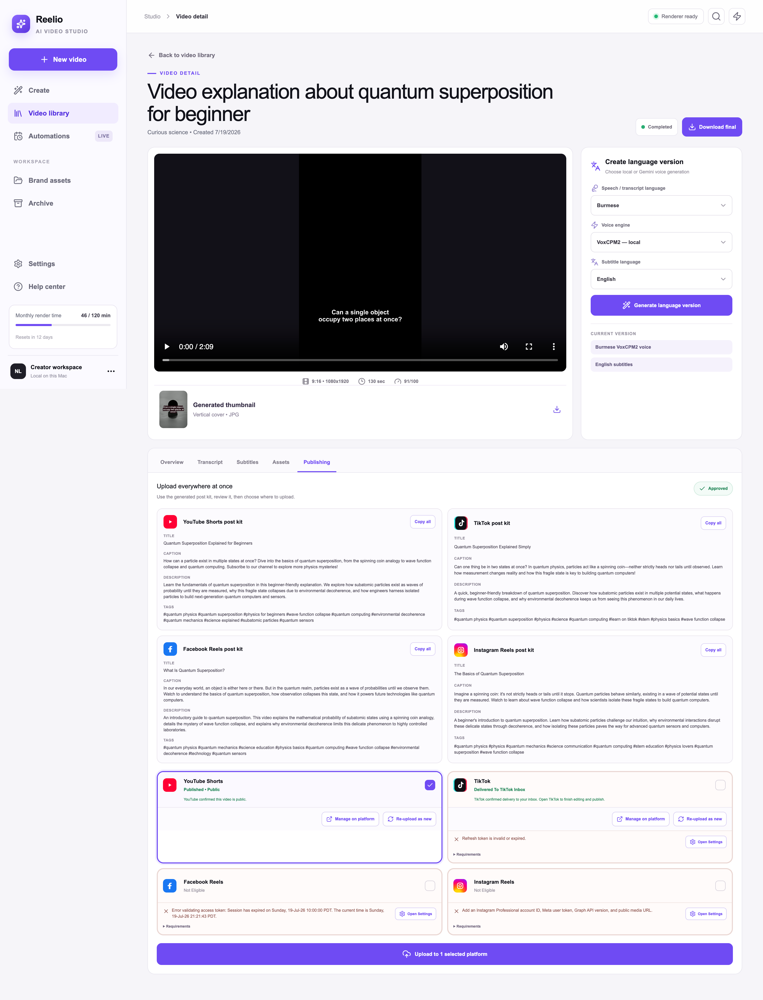
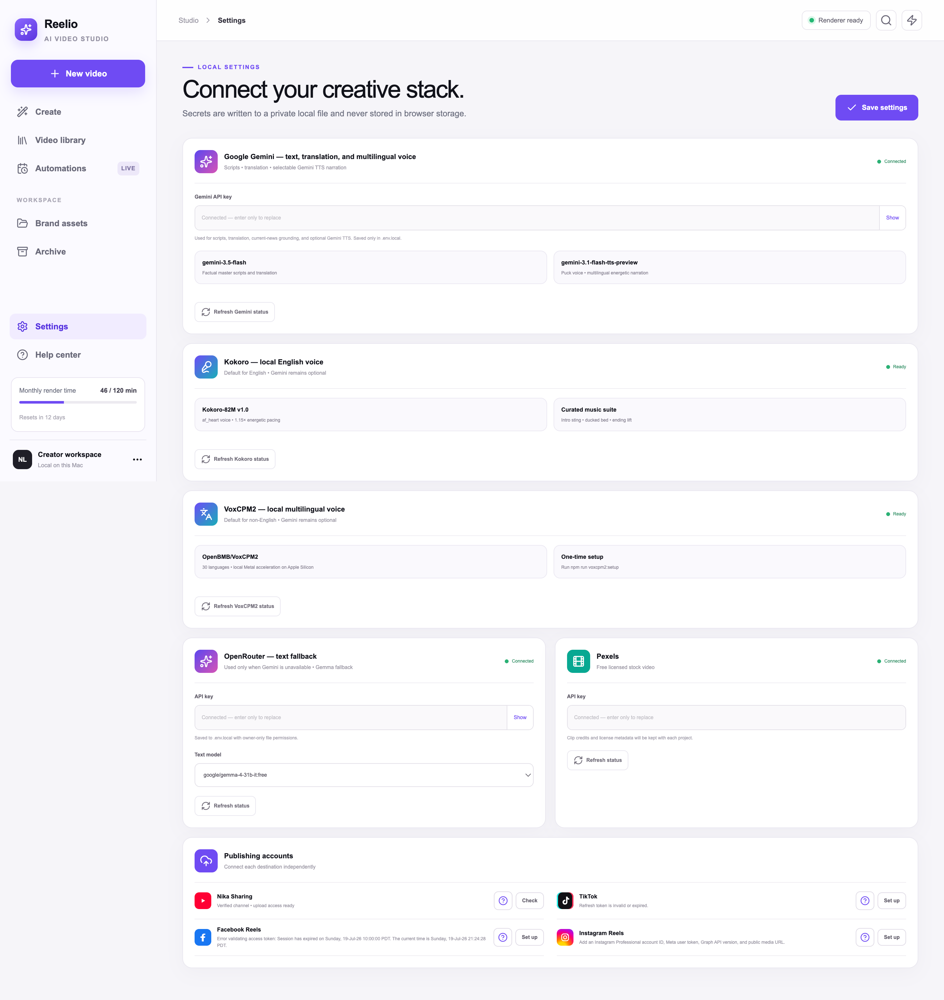

# Reelio

Reelio is a local-first AI studio for turning an idea into a finished vertical video package. It writes the script, finds or generates visuals, creates narration, builds subtitles, renders a real 1080×1920 video, and prepares platform-specific publishing copy.



## Highlights

- Generate scripts from a prompt, a suggested idea, or grounded current-news research.
- Render production-ready 9:16 video with FFmpeg.
- Use local narration with Kokoro for English and VoxCPM2 for multilingual speech.
- Optionally use Gemini for text, translation, and multilingual narration.
- Create transcripts, SRT subtitles, burned captions, thumbnails, clean video, and post copy.
- Pull licensed stock footage from Pexels or fall back to generated motion backgrounds.
- Build additional language versions from an existing video package.
- Review every output before publishing to YouTube, TikTok, Facebook, or Instagram.
- Keep projects, generated media, credentials, and job history on your Mac.

## Product tour

### Create a video package

Choose the topic, duration, speech language, subtitle language, voice engine, and target platforms. Reelio can also suggest an idea or research recent news.


### Manage the local video library

Completed, queued, and failed jobs remain available locally for preview, retry, download, and publishing.



### Review the finished video

Preview the rendered reel, inspect its retention preflight, download the final output, or create another language version.



### Inspect every deliverable

The detail workspace separates the overview, transcript, subtitles, downloadable assets, and publishing controls.

<details>
<summary>More video-detail screenshots</summary>

#### Overview



#### Transcript



#### Subtitles



#### Assets



#### Publishing



</details>

### Configure providers locally

API keys and publishing credentials are entered in Settings. Reelio writes them to a private, Git-ignored `.env.local` file and applies them to the running worker immediately.



## Requirements

- macOS
- Node.js 22.13 or newer
- [`uv`](https://docs.astral.sh/uv/getting-started/installation/) for the isolated local voice runtimes
- Enough free disk space for the optional local speech models and generated videos

FFmpeg and FFprobe are installed through the project dependencies.

## Quick start

```bash
git clone https://github.com/nainglynndw/Reelio.git
cd Reelio
npm install
npm run kokoro:setup
npm run dev
```

Open [http://localhost:3000](http://localhost:3000), go to **Settings**, enter the provider keys you want to use, and press **Save settings**.

You do not need to copy or manually edit `.env.example` for the default local setup. The Settings page creates `.env.local` automatically. Changes take effect immediately and persist across worker restarts.

For multilingual local narration, install VoxCPM2 separately:

```bash
npm run voxcpm2:setup
```

## Provider options

| Provider | Purpose | Required? |
| --- | --- | --- |
| Google Gemini | Primary script generation, translation, grounded news, optional TTS | Recommended |
| Kokoro | Local English narration | Installed locally |
| VoxCPM2 | Local multilingual narration | Optional local setup |
| OpenRouter | Hosted text fallback when Gemini is unavailable | Optional |
| Pexels | Licensed stock video search | Optional |

Without a hosted text key, Reelio can still use its built-in English idea and script fallback. Without Pexels, it renders original motion backgrounds.

## Publishing

Publishing is opt-in and requires explicit approval from the video-detail screen.

| Destination | Current behavior |
| --- | --- |
| YouTube Shorts | OAuth connection and direct upload |
| TikTok | OAuth connection and delivery to the creator's TikTok inbox |
| Facebook Reels | Direct Page upload using a Page access token |
| Instagram Reels | Direct Professional-account publishing; requires a public HTTPS media URL |

The current Facebook setup uses a manually supplied Page token. Tokens generated directly through Graph API Explorer may expire quickly. Durable Facebook OAuth and long-lived token handling are tracked in [Facebook authentication follow-up](docs/FACEBOOK_AUTH_FOLLOWUP.md).

## Production run

```bash
npm run production
```

This runs the production preflight, builds the web app, and starts both the web studio and loopback-only media worker. Keep the terminal window open while Reelio is running.

Verify a running installation with:

```bash
npm run healthcheck
```

## Local data and security

- The media worker binds to `127.0.0.1` by default.
- Browser origins are restricted by `REELIO_ALLOWED_ORIGINS`.
- Credentials are written to `.env.local` with owner-only file permissions and never stored in browser storage.
- `.env.local`, generated media, local models, state, build output, and worker logs are ignored by Git.
- Project state and generated media live under `.reelio/` by default.
- `state.backup.json` is maintained automatically for recovery.
- Request bodies, provider requests, and media processes use bounded limits and timeouts.

Credentials in `.env.local` are protected by filesystem permissions but are not encrypted with macOS Keychain.

## Configuration

Most users should configure credentials through Settings. `.env.example` documents advanced overrides for ports, paths, timeouts, model selection, redirect URLs, and the local data directory.

To move the production library:

```bash
REELIO_DATA_DIR=/path/to/library npm run production
```

## Development commands

| Command | Purpose |
| --- | --- |
| `npm run dev` | Start the web app and local worker with development reload |
| `npm run build` | Build the production web app |
| `npm run production` | Run preflight, build, and start production services |
| `npm run lint` | Run ESLint |
| `npm test` | Build and run the Node test suite |
| `npm run check` | Run lint and tests |
| `npm run healthcheck` | Check the running web app and worker |
| `npm run kokoro:setup` | Install the local Kokoro runtime and model |
| `npm run voxcpm2:setup` | Install the local VoxCPM2 runtime and model |

The worker API defaults to [http://127.0.0.1:8788](http://127.0.0.1:8788). Health endpoints are `/health` and `/ready`; workflow endpoints include `/jobs`, `/automations`, and `/agent-trigger`.

## Validate before contributing

```bash
npm run check
```

Do not commit `.env.local`, `.reelio/`, generated videos, downloaded models, or provider credentials.
